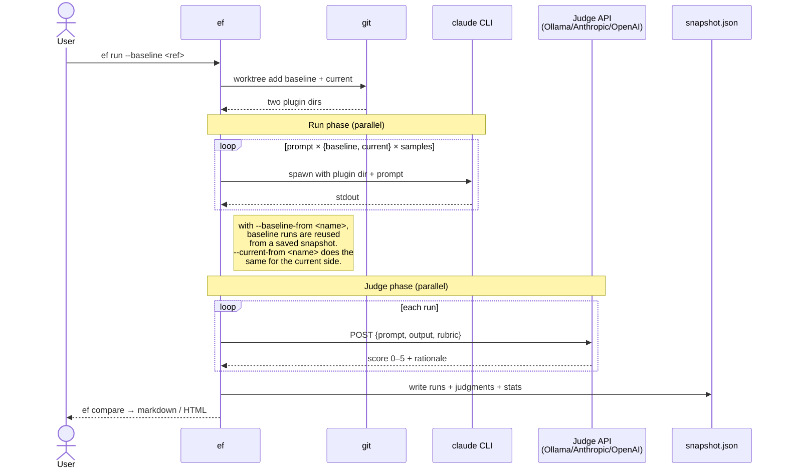

# eval-bench

Benchmark Claude Code plugins by A/B comparing plugin versions with LLM-judged evaluation prompts.

Runs a fixed set of prompts against two versions of your plugin (baseline vs current), invokes the real `claude` CLI so skills, MCP servers, subagents, slash commands, and hooks actually load, grades each output with a configurable judge (local Ollama, Anthropic, OpenAI, or any OpenAI-compatible endpoint), and produces a side-by-side comparison.

## How it works



The provider (`claude` CLI) and judge (HTTP API) are independent — the judge never sees `claude`, only the captured output and your rubric.

## Install

```bash
npm i -g eval-bench
# or
npx eval-bench --help
```

Requires:
- Node 20+
- `claude` CLI on PATH ([install instructions](https://docs.anthropic.com/claude-code))
- Your plugin in a git repo (required for baseline checkout via `git worktree`)
- A judge: either Ollama installed locally, or an API key for Anthropic/OpenAI

**Note:** You don't need a full plugin structure—if you only have standalone `skills/*.md` or `agents/*.md` files without `.claude-plugin/plugin.json`, eval-bench will automatically create a temporary minimal plugin manifest for you.

## Quickstart

```bash
cd my-claude-plugin

# scaffold .eval-bench/ (config, prompts template, snapshots dir)
eb init

# write your eval prompts and rubrics
$EDITOR .eval-bench/prompts.yaml

# freeze a reference snapshot at v1.0.0 — runs the matrix once at one ref
eb eval --ref v1.0.0 --save-as v1-baseline

# make changes to your plugin...

# diff your changes against the saved baseline; only the current side runs
eb run --baseline-from v1-baseline --save-as wip --compare v1-baseline

# narrow the matrix to one or a few prompts while iterating on a rubric
eb run --baseline-from v1-baseline --save-as wip --only find-user-by-email

# already have an `eb eval` snapshot at HEAD? promote it to a dual-variant
# snapshot by stitching it against the saved baseline — no fresh claude runs,
# both `eb compare` and `eb view` work
eb run --baseline-from v1-baseline --current-from wip --save-as wip-vs-v1

# a few rows failed yesterday (judge timeout, quota)? re-run only those
eb run --baseline main --save-as baseline --retry-failed

# changed the judge in eval-bench.yaml? re-score cached Claude outputs
# without re-running Claude — answers "did the new judge change the verdict?"
eb run --save-as wip --rejudge

# diagnose a slow / stuck judge — writes a per-invocation debug log under
# .eval-bench/snapshots/<name>/debug-<ts>.log with full HTTP bodies and
# Ollama timing fields, plus a colorized stderr mirror
eb run --baseline main --save-as baseline --debug

# side-by-side outputs in the browser
eb view wip
```

`eb eval` produces a single-variant snapshot (one ref). `eb run --baseline-from <name>` reuses it instead of regenerating the baseline side, so each iteration only pays for the current ref. The mirror `--current-from <name>` reuses a saved snapshot's runs for the *current* side instead — combine both to stitch two `eb eval` snapshots into one dual-variant snapshot with zero fresh runs (handy when you've already evaluated both sides and just want a `view`-able A/B). `--only <ids>` (comma-separated, repeatable) restricts the matrix to specific prompt ids — useful when iterating on one rubric. Plain `eb run --baseline <ref> --current <ref>` still works when you want to A/B two refs in one shot (CI gating).

Full walkthrough: [docs/quickstart.md](docs/quickstart.md).

## Docs

- [docs/quickstart.md](docs/quickstart.md) — zero to first comparison in ten minutes
- [docs/concepts.md](docs/concepts.md) — plugin, baseline, variant, sample, judge, rubric, snapshot
- [docs/config.md](docs/config.md) — every field in `.eval-bench/eval-bench.yaml` and `.eval-bench/prompts.yaml`
- [docs/rubrics.md](docs/rubrics.md) — how to write rubrics that produce reliable scores
- [docs/judges.md](docs/judges.md) — picking a judge; local vs hosted tradeoffs; known-good models
- [docs/ci.md](docs/ci.md) — GitHub Actions, GitLab CI, self-hosted GPU runners
- [docs/troubleshooting.md](docs/troubleshooting.md) — common failure modes
- [docs/comparison-to-promptfoo.md](docs/comparison-to-promptfoo.md) — when to use this tool vs raw Promptfoo

## License

MIT.
