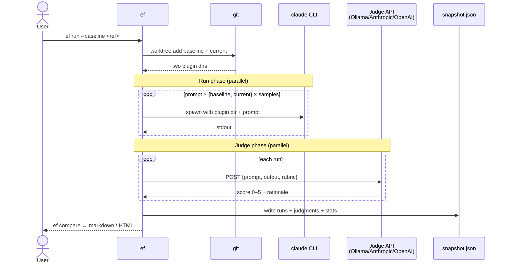

# eval-bench

Benchmark Claude Code plugins by A/B comparing plugin versions with LLM-judged evaluation prompts.

Runs a fixed set of prompts against two versions of your plugin (baseline vs current), invokes the real `claude` CLI so skills, MCP servers, subagents, slash commands, and hooks actually load, grades each output with a configurable judge (local Ollama, Anthropic, OpenAI, or any OpenAI-compatible endpoint), and produces a side-by-side comparison.

## How it works



The provider (`claude` CLI) and judge (HTTP API) are independent — the judge never sees `claude`, only the captured output and your rubric.

## Install

```bash
npm i -g eval-bench
# or
npx eval-bench --help
```

Requires:
- Node 20+
- `claude` CLI on PATH ([install instructions](https://docs.anthropic.com/claude-code))
- Your plugin in a git repo (required for baseline checkout via `git worktree`)
- A judge: either Ollama installed locally, or an API key for Anthropic/OpenAI

**Note:** You don't need a full plugin structure—if you only have standalone `skills/*.md` or `agents/*.md` files without `.claude-plugin/plugin.json`, eval-bench will automatically create a temporary minimal plugin manifest for you.

## Quickstart

```bash
cd my-claude-plugin

# Create .eval-bench/ with config, prompts template, and snapshots directory
eb init

# Edit prompts.yaml with evaluation tests for your plugin
$EDITOR .eval-bench/prompts.yaml

# Run prompts against v1.0.0 (baseline) and HEAD (current), save results
# This creates .eval-bench/snapshots/v1-baseline.json with scores + outputs
eb run --baseline v1.0.0 --save-as v1-baseline

# Make changes to your plugin...

# Compare new version against saved v1-baseline results
# Reuses v1.0.0 results, only runs HEAD with your changes
eb run --baseline v1-baseline --save-as wip --compare v1-baseline

# Open side-by-side comparison in browser
eb view wip
```

Full walkthrough: [docs/quickstart.md](docs/quickstart.md).

## Docs

- [docs/quickstart.md](docs/quickstart.md) — zero to first comparison in ten minutes
- [docs/concepts.md](docs/concepts.md) — plugin, baseline, variant, sample, judge, rubric, snapshot
- [docs/config.md](docs/config.md) — every field in `.eval-bench/eval-bench.yaml` and `.eval-bench/prompts.yaml`
- [docs/rubrics.md](docs/rubrics.md) — how to write rubrics that produce reliable scores
- [docs/judges.md](docs/judges.md) — picking a judge; local vs hosted tradeoffs; known-good models
- [docs/ci.md](docs/ci.md) — GitHub Actions, GitLab CI, self-hosted GPU runners
- [docs/troubleshooting.md](docs/troubleshooting.md) — common failure modes
- [docs/comparison-to-promptfoo.md](docs/comparison-to-promptfoo.md) — when to use this tool vs raw Promptfoo

## License

MIT.
